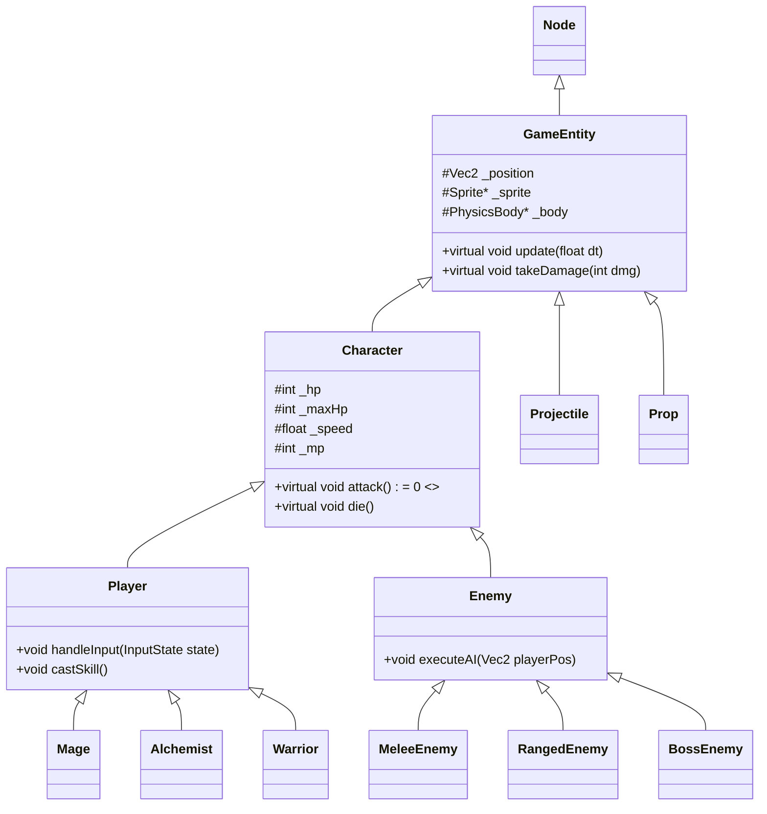

# Ark-knights 项目设计思路 (General Design Document)

## 1. 项目概况 (Project Overview)

- **项目名称**：Ark-knights (基于《元气骑士》玩法的 2D Roguelike 游戏)
- **开发框架**：Cocos2d-x 4.0
- **开发语言**：C++ (标准：C++11/14/17)
- **团队规模**：2人
- **运行平台**：Windows / Mac
- **核心玩法**：俯视角射击/动作 + 地牢探索 + 随机要素

## 2. 总体架构设计 (Architecture Design)

本项目采用面向对象设计 (OOP) 思想，利用 Cocos2d-x 的节点系统（Scene Graph）作为渲染基础，逻辑层采用**组件化**或**继承体系**相结合的方式。

### 2.1 类继承体系 (Class Hierarchy)

为了满足《项目说明书》中关于“类、继承、多态”的考察要求，核心实体设计如下：

### 2.2 核心模块划分

1. **Scene Manager (场景管理)**MainMenuScene: 游戏入口，角色选择。GameScene: 核心战斗场景，包含 GameLayer (游戏逻辑) 和 HUDLayer (UI)。GameOverScene: 结算与重开。
2. **Map System (地图生成系统)**MapGenerator: 负责算法生成，利用预制件（Prefabs）拼接房间。Room: 房间类，包含门的位置、敌人刷新点、障碍物数据。
3. **Input Manager (输入管理)**监听键盘（WASD、J/K/L）和鼠标事件，解耦输入与逻辑。
4. **Collision Manager (碰撞管理)**利用 Cocos2d-x 自带物理引擎或自定义 AABB 碰撞检测，处理 Player vs Enemy，Projectile vs Entity 的交互。

## 3. 核心功能实现思路 (Feature Implementation)

### 3.1 地图系统 (Roguelike 核心)

- **实现方式**：定义一个 N x N 的网格系统。使用 DFS (深度优先搜索) 或随机游走算法生成房间连接路径。**锁门机制**：进入 Room 后，检测当前房间 EnemyList 是否为空。若不为空，触发 CloseDoor 事件；当 EnemyList 清空时，触发 OpenDoor。

### 3.2 角色与战斗

- **状态机 (FSM)**：为角色设计 State 枚举：IDLE, RUN, ATTACK, SKILL, HIT, DIE。update() 函数根据当前状态播放对应动画、执行对应逻辑。
- **技能系统**：**法师**：实例化 Projectile 类（火球），设定初速度和方向。**炼金**：在地面生成 AreaEffect 对象（毒圈），进入区域的敌人每秒扣血。**战士**：生成近战判定框（Hitbox），检测重叠并造成瞬间伤害。

### 3.3 敌人 AI

- **基础 AI**：每帧计算 Player 位置与自身的距离 dist。if (dist > attackRange) -> 调用 moveTowards(playerPos)。if (dist <= attackRange) -> 调用 attack()。
- **Boss 阶段**：在 BossEnemy::takeDamage() 中检测 HP。当 HP < 50% 时，切换贴图，改变攻击频率或模式（Enrage Mode）。

## 4. C++ 特性应用规划 (C++ Features)

根据要求（至少 3 条），本项目将强制应用以下特性：

1. **STL 容器 (STL Containers)**std::vector<Enemy*> _enemies：管理当前房间内的所有敌人。std::map<std::string, Animation*> _animCache：资源缓存管理。**目的**：高效管理动态对象。
2. **多态与虚函数 (Polymorphism)**基类 Character 定义纯虚函数 virtual void useSkill() = 0;。子类 Mage, Warrior 分别实现具体的技能逻辑。**目的**：实现不同角色的差异化，同时统一调用接口。
3. **C++11 特性 (C++11 Features)****Lambda 表达式**：用于 Cocos 的动作回调，例如 CallFunc::create([=](){ this->removeFromParent(); });。**Auto 关键字**：简化迭代器遍历代码。**std::function**：用于实现事件回调系统（如敌人死亡回调）。
4. **类型转换 (Type Casting)**使用 static_cast 进行安全的向下转型（如从 Node* 转为 GameEntity*）。**目的**：符合 Google C++ Style 要求。

## 5. 团队分工 (Team Division)

### 成员 A (组长)

- **职责**：架构搭建、核心战斗逻辑、地图生成。
- **具体任务**：搭建 Git 仓库和 Cocos 项目基础结构。实现 GameEntity, Character, Player 基类。编写 **地图生成算法** (MapGenerator) 和房间切换逻辑。实现碰撞检测回调处理。

### 成员 B

- **职责**：AI 逻辑、UI 系统、资源整合。
- **具体任务**：实现 Enemy 基类及 3 种基础怪物 AI。设计并实现 Boss 的状态机和技能。制作 HUD（血条、蓝条）、暂停菜单、结算界面。负责音效/音乐管理 (AudioEngine)。

## 6. 版本控制与代码规范 (Git & Coding Style)

- **Git 规范**：主分支 main 保持可运行状态。Commit Message 格式：[Type] Description (例：[Feat] Add Mage fireball skill)。
- **代码规范**：遵循 Google C++ Style Guide。类成员变量以下划线结尾或 m_ 开头（如 m_health）。必须包含适当的注释。